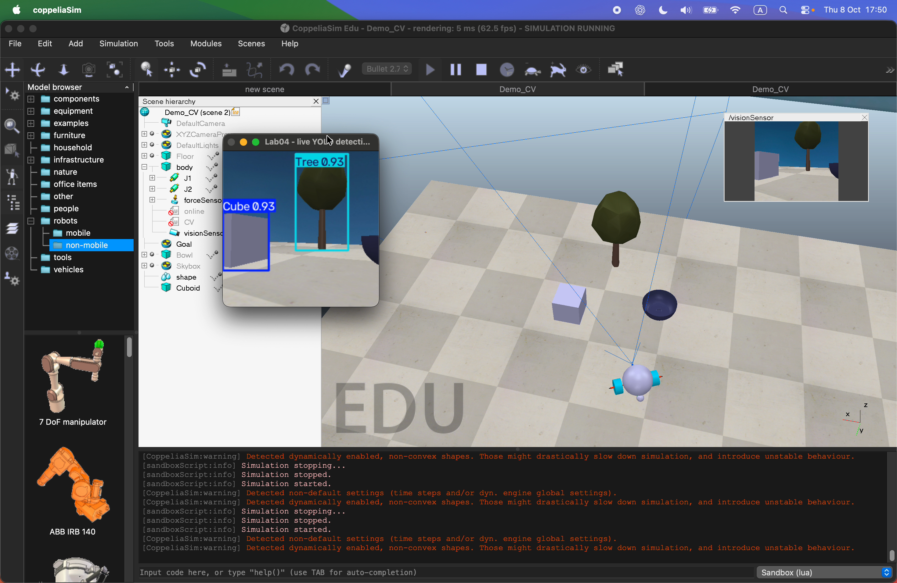
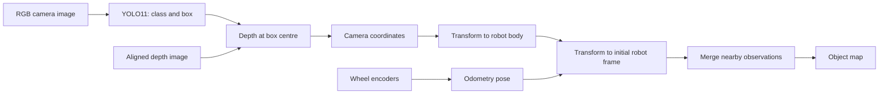
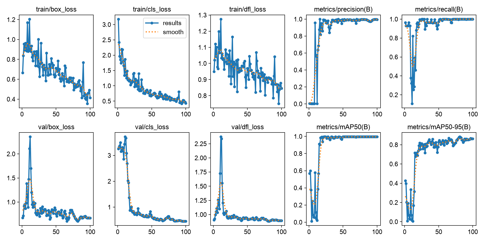
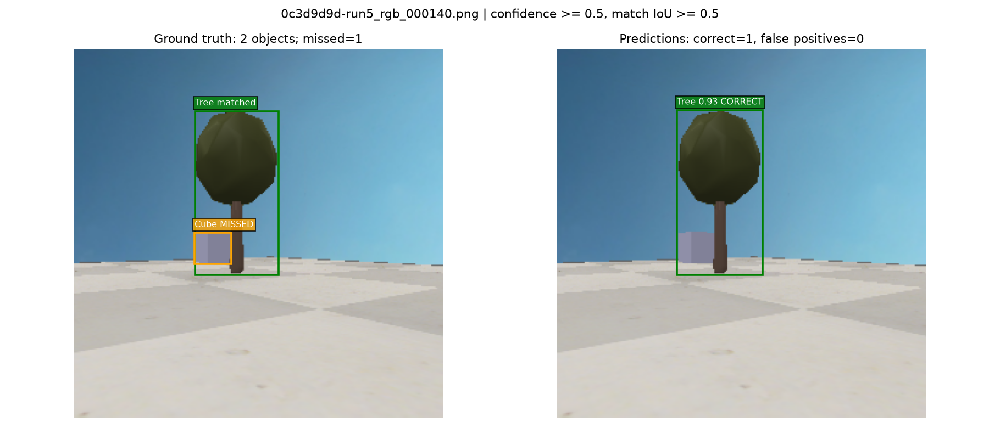
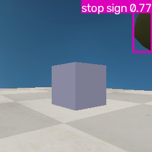
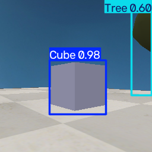
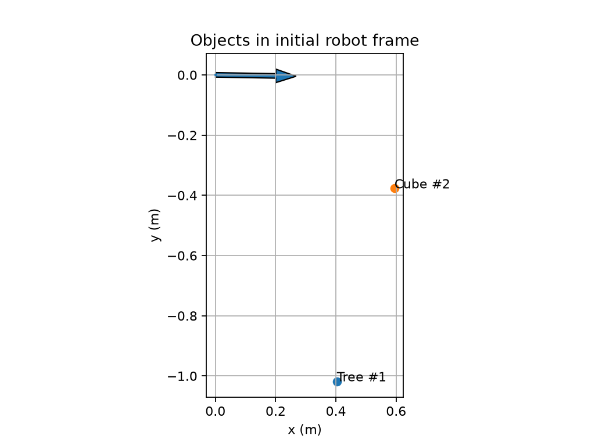

# Robot vision: YOLO11 detection and object mapping

A CoppeliaSim robot scans its surroundings, detects **Cube** and **Tree**, and estimates their positions using camera depth and wheel encoder odometry. This repository contains my labelled dataset, two trained detectors, evaluation records, and a live demonstration.

**Author:** [Jirath Thanabarameth (Paopao)](https://github.com/Paosososo)

## Live demonstration

[](https://github.com/Paosososo/robot-vision-yolo-mapping/releases/download/demo-v1/Lab04_Jirath_Demo_CV_Live_Object_Detection.mov)

**[Watch or download the original recording](https://github.com/Paosososo/robot-vision-yolo-mapping/releases/download/demo-v1/Lab04_Jirath_Demo_CV_Live_Object_Detection.mov)** · 22.6 seconds · 73.3 MB

The recording shows the robot moving in CoppeliaSim and a separate OpenCV window displaying live bounding boxes, class names, and confidence scores. The preview above is an unedited frame extracted at 19 seconds. This is a demonstration of the running pipeline; it is not a measured detector FPS benchmark. Video metadata and its checksum are recorded in [docs/demo.json](docs/demo.json).

## My work

This is a coursework project built from supplied Lab 04 Python scripts and simulator scenes. I collected camera images, annotated Cube and Tree in Label Studio, prepared a split by capture run, trained models with and without augmentation, examined prediction errors, and compared mapped positions with simulator coordinates. I also recorded the live demonstration. The live preview and this portfolio packaging were prepared with coding assistance. [Provenance](docs/PROVENANCE.md) distinguishes the supplied material, experiment evidence, and later portfolio changes.

The main question was practical: **can a detector adapted to this simulated scene identify the intended objects and place them on a map?**

## From camera image to map



In [main.py](main.py), opposite wheel commands turn the robot on the spot. Encoder changes estimate its position and heading. At each detection step, YOLO supplies a class and bounding box. The controller takes the median valid depth in a small patch around the box centre, projects that pixel into 3D, and applies the camera-to-body transform and estimated robot pose. Nearby observations of the same class are averaged into a landmark.

This is an object map built from encoder odometry and RGB/depth detections. The controller does not implement loop closure or a full SLAM system. The [experiment notes](docs/EXPERIMENT.md) explain the coordinate transforms and their limits.

## Dataset and split

The published dataset uses **class 0 = Cube** and **class 1 = Tree**. The bowl is outside this custom detector's two classes. Empty label files represent reviewed background images. See [data/dataset.yaml](data/dataset.yaml) and [data/README.md](data/README.md).

| Dataset property | Training | Validation |
| --- | ---: | ---: |
| Capture runs | 1–4 | 5 |
| Image/label pairs | 115 | 23 |
| Distinct image contents, by SHA-256 | 92 | 23 |
| Repeated image files within the split | 23 | 0 |
| Cube boxes | 23 | 14 |
| Tree boxes | 43 | 14 |
| Background images | 64 | 9 |

Source: [data/audit.json](data/audit.json), reproducible with [scripts/verify_artifacts.py](scripts/verify_artifacts.py). **No exact image hash is shared between training and validation.** The training set still contains repeated imports; those files are preserved because they were used in the recorded experiments. The audit does not establish independence of similar frames or different scenes.

I used capture runs to keep related frames together. Run 5 was used for validation during training and model selection, so these results are validation results. There is no separate final test set in this repository.

## Training experiment

Both runs started from `yolo11n.pt`, used the same published split, and trained for **100 epochs on CPU with `imgsz=320`**. The model was fine-tuned rather than trained from random weights. Ultralytics documents YOLO11 detection models and their pretrained weights in its [YOLO11 reference](https://docs.ultralytics.com/models/yolo11/).

| Training profile | Best recorded epoch | Precision | Recall | mAP50 | mAP50–95 |
| --- | ---: | ---: | ---: | ---: | ---: |
| No augmentation | 54 | 0.823 | 0.956 | 0.834 | 0.594 |
| Mild augmentation | 81 | 0.996 | 1.000 | 0.995 | 0.882 |

Source: [training comparison](artifacts/training/comparison.json), calculated from the highest validation mAP50–95 row in each saved `results.csv`. These are the best recorded rows, not the final epoch. Both original `best.pt` checkpoints are included in [models](models/README.md).

Mild augmentation changes colour, position, scale, and orientation and sometimes combines images with mosaic. The exact settings are in [train.py](train.py) and the saved [training arguments](artifacts/training/objects_augmented/args.yaml). My interpretation is that these variations helped the detector handle changes in the validation views. This comparison supports an improvement on this split; it does not isolate which transformation caused it. See the [Ultralytics augmentation guide](https://docs.ultralytics.com/guides/yolo-data-augmentation/) for how the transformations work.



## Evaluation and error inspection

Evaluating the augmented checkpoint again produced **mAP50 = 0.995** and **mAP50–95 = 0.8823** on the 23 validation images. Source: [saved evaluation metrics](artifacts/evaluation/metrics.json).

The image comparisons use a fixed confidence threshold of **0.5** and a matching IoU threshold of **0.5**. They contain **27 correct detections, 0 false positives, and 1 missed object** across 28 annotated objects. Source: [comparison summary](artifacts/evaluation/comparisons/summary.json).



In this example, the Tree is detected but the Cube is missed at the chosen threshold. The aggregate validation report and this preview use different confidence handling, so a reported recall of 1.0 does not mean every object appears in the fixed-threshold preview. Both procedures are visible in [evaluate.py](evaluate.py).

## Generic model versus adapted model

| Generic `yolo11n.pt` | My augmented Cube/Tree detector |
| --- | --- |
|  |  |

These saved frame 35 images show the generic model labelling part of the Tree as a **stop sign**, while the adapted model detects **Tree** and **Cube**. In another saved [generic frame](docs/images/generic_tree_umbrella.png), the Tree is labelled **umbrella**. Sources: the images above, copied from the recorded controller outputs.

The pretrained detector uses COCO classes, which include stop sign and umbrella but do not include dedicated Cube and Tree classes. See the [COCO class list](https://docs.ultralytics.com/datasets/detect/coco/). This explains why adaptation to the task's class definitions matters. A high confidence score alone does not establish that a label is correct.

## Mapping result



| Object | Estimated (x, y), metres | Reference (x, y), metres | Position error |
| --- | --- | --- | ---: |
| Tree | (0.4033, -1.0179) | (0.3744, -1.0857) | 7.37 cm |
| Cube | (0.5944, -0.3769) | (0.6000, -0.5250) | 14.82 cm |

Source: [mapping comparison](artifacts/mapping/original_scene/comparison.csv), combining saved [landmarks](artifacts/mapping/original_scene/objects.json) with coordinates read from CoppeliaSim relative to `/body`. Error is the Euclidean distance between the two XY positions. The reference commands and transcription are in [docs/EXPERIMENT.md](docs/EXPERIMENT.md).

These errors belong to the recorded original-scene scan. The video is a separate demonstration, and the portfolio defaults use a slower rotation speed. A new run may give different values. Depth samples an observed surface, whereas the simulator reference is an object origin; odometry, box placement, and depth sampling can also affect the result. Their individual contributions have not been measured.

## Run the project

Install CoppeliaSim separately and keep its application open with the simulation stopped. The controller loads the configured scene and starts the simulation itself. It connects to the [ZeroMQ remote API](https://manual.coppeliarobotics.com/en/zmqRemoteApiOverview.htm) on `localhost:23000`.

```bash
git clone https://github.com/Paosososo/robot-vision-yolo-mapping.git
cd robot-vision-yolo-mapping
python3 -m venv .venv
source .venv/bin/activate
python -m pip install -r requirements.txt
python main.py --weights models/objects_augmented/best.pt --show --output-dir output/demo
```

`--show` opens the annotated camera window. Press **Q** or **Esc** in that window to stop early and save a partial map. A completed run writes `map.png`, `objects.json`, `odometry.csv`, clean `rgb_*.png` images, and annotated `frame_*.png` images under the chosen output directory. These behaviours are implemented in [main.py](main.py).

The `SETTINGS` dictionary controls scene paths, wheel dimensions, confidence, and rotation speed. The portfolio default is `Demo_CV.ttt` with `angular_speed_rad_s = 0.5`. Runtime prediction does not explicitly set `imgsz`; the 320 setting applies to the training and evaluation commands below.

Other runs:

```bash
# Encoder odometry without object detection
python main.py --odom-only --output-dir output/odometry

# Generic pretrained detector comparison
python main.py --weights yolo11n.pt --show --output-dir output/generic

# Validation metrics and an image-by-image inspection
python evaluate.py --weights models/objects_augmented/best.pt --data data/dataset.yaml --split val --imgsz 320 --device cpu --preview

# Repeat the two training profiles into new output directories
python train.py --data data/dataset.yaml --imgsz 320 --epochs 100 --augmentation none --name reproduced_no_aug --device cpu
python train.py --data data/dataset.yaml --imgsz 320 --epochs 100 --augmentation mild --name reproduced_augmented --device cpu

# Check the published dataset and saved evidence without ML dependencies
python scripts/verify_artifacts.py
```

The starting `yolo11n.pt` file is not bundled; Ultralytics can download pretrained weights when loading the model, so the first generic run or training run needs network access. The two fine-tuned checkpoints are already included. [Environment metadata](artifacts/environment.json) records the local package versions at packaging time, rather than promising identical results on every machine.

## What I learned and what remains open

This experiment connected annotation quality, validation design, model adaptation, and robot coordinates. Splitting by filename alone is insufficient when the same image content can appear under different names. Saved previews also reveal failures that a single aggregate score can hide. Finally, a correct object label and an accurate object position are separate checks.

The remaining limits are concrete: a small simulated dataset, repeated training images, validation reused for model selection, and no independent test on new scenes or a physical robot. A useful next experiment would deduplicate the training data and evaluate on newly captured, separately held-out scenes. That experiment has not been performed here.

See [provenance and file guide](docs/PROVENANCE.md) for the evidence layout and attribution. No blanket licence is assigned to the supplied coursework materials; upstream tools retain their own licences.
